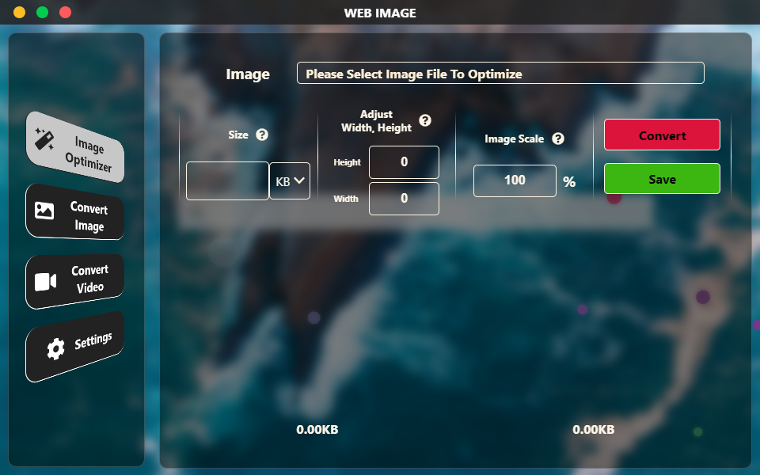
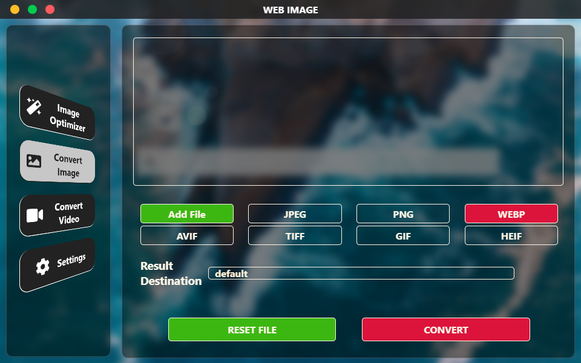
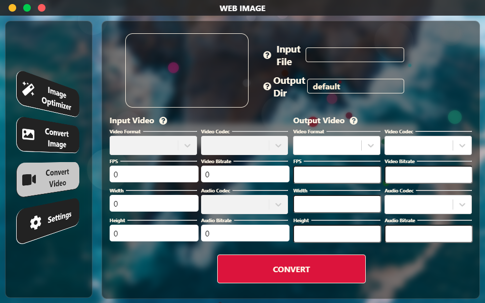
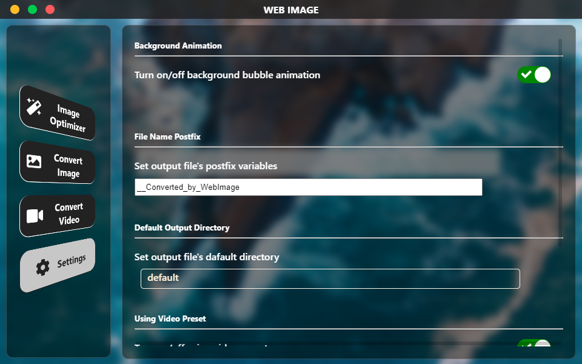

# Web Image

Gui Tool for optimizing / converting image/video files into web-friendly format


    
[]()
[](https://opensource.org/licenses/)


  
**Powered By**


## Index

- [Features](#Features)
- [Installation](#Installation)
- [First Look](#First-Look)
- [For development](#For-Development)
- [Contact](#Contact)
- [__!important Additional Licence__](#Additional-Licence)


## Features

- Optimize image file
- Convert Image files
- Convert Video files

  
## Installation

Get file from [__Release Section__](https://github.com/yusa-imit/WebImage/releases)


## First Look
#### Ocean-ish image in backgroun is not included. It's just my desktop background

### Image Optimize



          
          
### Image Convert
          
          
     


### Video Convert
          
          
    


### Settings
          
          
          
          


  
## For Development

### Git clone & Dependancy install

For Development using npm
```bash
  git clone https://github.com/yusa-imit/WebImage.git
  cd WebImage
  npm install
  npm run start
```


using yarn

```bash
  git clone https://github.com/yusa-imit/WebImage.git
  cd WebImage
  yarn
  yarn start
```


### Compile


using npm
```bash
  npm run make
```


using yarn
```bash
  yarn make
```

### Publish


using npm
```bash
  npm run publish
```


using yarn
```bash
  yarn run publish
```


## Contact


Open new issue in this repository's [__Issues tab__](https://github.com/yusa-imit/WebImage/issues)


## Additional Licence

This program is using FFMPEG module for processing video.
If you are going to use MOV preset or other licensed library, you need to see the [LICENSE from FFMPEG](https://github.com/FFmpeg/FFmpeg/blob/master/LICENSE.md)
